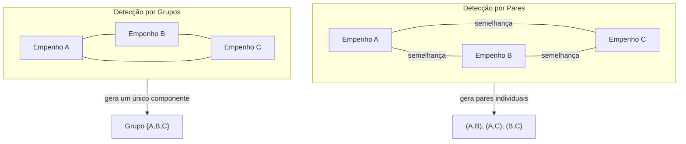

# Detecção de Fracionamento em Grupos

Este módulo implementa a lógica para **identificação de grupos de empenhos que podem indicar fracionamento**,
utilizando dados armazenados no banco PostgreSQL com extensão **pgvector** e análise de similaridade semântica.

---

## Fluxo do script `detect_fracionamento_grupos.py`

1. Busca os empenhos no Postgres já com embeddings (tabela `empenho_embeddings`).
2. Filtra apenas os registros com `vlr_empenhado < VALOR_LIMIAR`.
3. Agrupa os dados por `(idunid, elemdespesatce)`.
4. Para cada grupo:
   - Constrói um **grafo de similaridade**:
     - Nós = empenhos
     - Arestas = pares de empenhos que satisfazem condições (janela temporal + similaridade)
   - Identifica os **componentes conexos** no grafo.
5. Cada componente com 2 ou mais empenhos é considerado um possível **grupo de fracionamento**.
6. Salva os resultados em `suspeitas_fracionamento_grupos.csv`.

---

## Parâmetros ajustáveis

No script, é possível ajustar:

- `VALOR_LIMIAR` → valor máximo do empenho para análise (ex.: 50.000).  
- `JANELA_DIAS` → intervalo de tempo considerado (ex.: 30, 60 ou 90 dias).  
- `SIMILARIDADE_MINIMA` → limite mínimo de similaridade entre históricos (0 a 1).

---

## Explicação dos parâmetros

- **VALOR_LIMIAR**  
  Este parâmetro define o **teto de valor** para os empenhos analisados.  
  Apenas empenhos **abaixo desse valor** são considerados pelo script, pois são os que poderiam estar sendo **fracionados artificialmente** para evitar licitação.  
  Exemplo: se `VALOR_LIMIAR = 8.000`, empenhos de 5.000 entram na análise; empenhos de 20.000 são ignorados.  

- **JANELA_DIAS**  
  Define o intervalo de tempo em que dois ou mais empenhos são considerados relacionados.  
  Exemplo: se `JANELA_DIAS = 60`, empenhos semelhantes emitidos até 60 dias de diferença podem formar um grupo suspeito.  

- **SIMILARIDADE_MINIMA**  
  Define o limiar da **similaridade semântica** entre os históricos.  
  Valores próximos de 1 indicam textos quase idênticos.  
  Exemplo: se `SIMILARIDADE_MINIMA = 0.8`, apenas empenhos com descrições bastante parecidas entram na análise.

---

## Execução

Execute o script diretamente no Python:

```bash
python detect_fracionamento_grupos.py
```

Saída esperada:

```
Carregando empenhos...
Total de empenhos carregados: XXXXX
Detectando possíveis fracionamentos em grupos...
Total de grupos suspeitos: YYYYY
Resultados salvos em suspeitas_fracionamento_grupos.csv
```

---

## Resultado

Um arquivo CSV contendo os grupos suspeitos, com as seguintes colunas:

- `idunid`  
- `elemdespesatce`  
- `qtd_empenhos` (tamanho do grupo)  
- `idempenhos` (lista de empenhos)  
- `vlr_total` (soma dos valores)  
- `datas` (datas dos empenhos no grupo)

---

## Diferença entre análise por pares e por grupos



---
